# argocd-mlops-gitops

GitOps ML/AI deployment platform:
**GitHub → GitHub Actions → ECR → Argo CD → EKS → AWS ALB → Internet**.

The ML/AI API is a FastAPI service with `/`, `/health` and `/predict`. On
every commit, CI builds it into an image and pushes it to ECR. Argo CD then
deploys whatever is in Git to EKS and exposes it through an AWS Application
Load Balancer.

See [docs/architecture.md](docs/architecture.md) for the design and roadmap.

```
 git push (app/)                         git push (k8s/)
      │                                        │
      ▼                                        │
 GitHub Actions ── OIDC ──► AWS IAM role       │
      │ docker build/push                      │
      ▼                                        │
     ECR  argocd-ml-api:<sha>                  │
      │                                        │
      └─ bot commits new tag to k8s/ ──────────┤
                                               ▼
                                     Argo CD (auto-sync, prune, self-heal)
                                               │
                                               ▼
                                   EKS  ml-platform namespace
                                               │
                                               ▼
                                  AWS ALB (Load Balancer Controller)
                                               │
                                               ▼
                                            Internet
```

---

## End-to-end run, recorded

Every screenshot below comes from a real run of this repo on AWS
(account `482545366109`, `us-east-1`, EKS 1.34) on 2026-10-03. The terminal
images show real command output from that session. The environment was torn
down afterwards, so the ALB URL no longer resolves.

### 1. CI: GitHub Actions builds and pushes the image

A push that touches `app/` (or the workflow file) starts
[`build-push.yaml`](.github/workflows/build-push.yaml). It logs in to AWS
through GitHub OIDC (no stored keys), builds the image, pushes it to ECR with
the short commit SHA as the tag, and commits that tag back to
`k8s/deployment.yaml`.

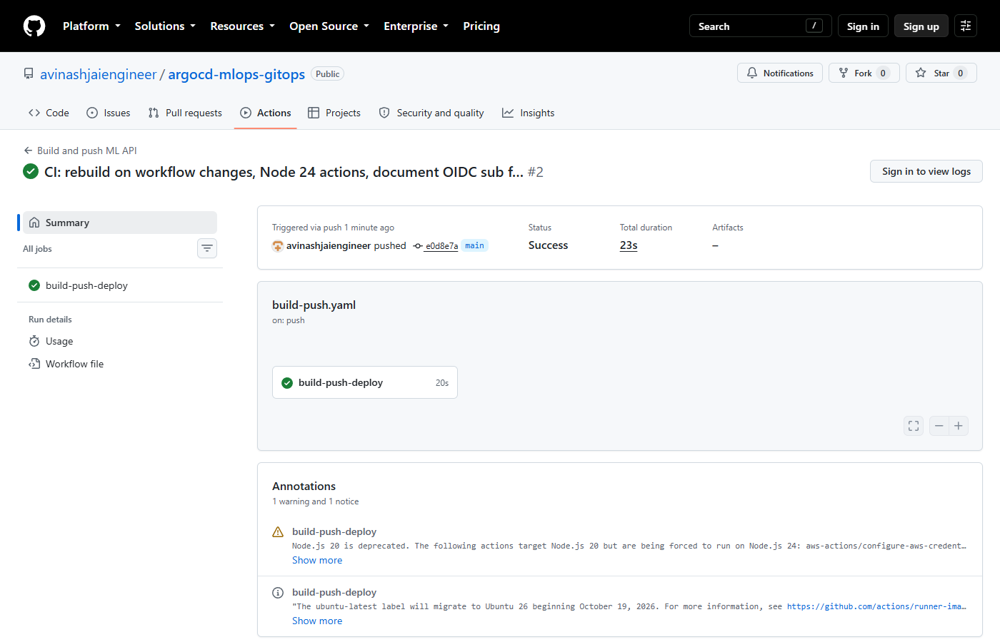

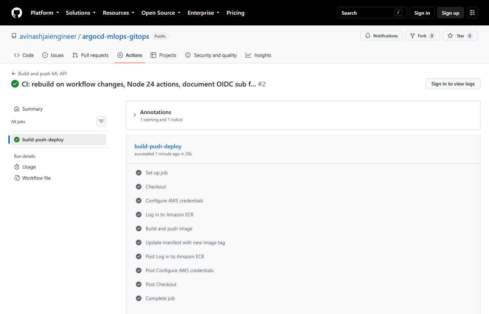

The bot's `Deploy ml-api e0d8e7a` commit is how CI hands a release to the
GitOps side:

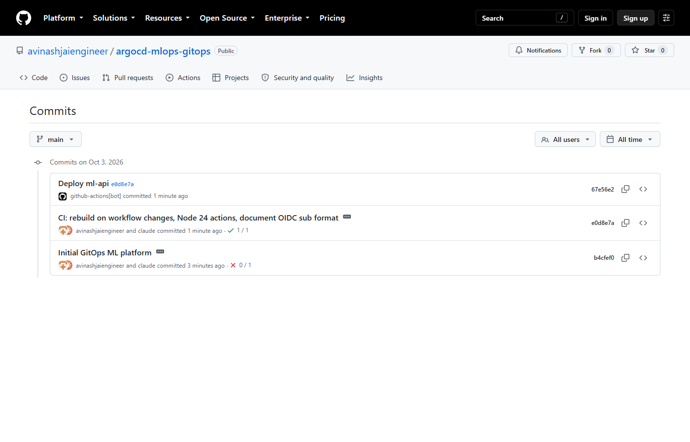

### 2. The image in Amazon ECR

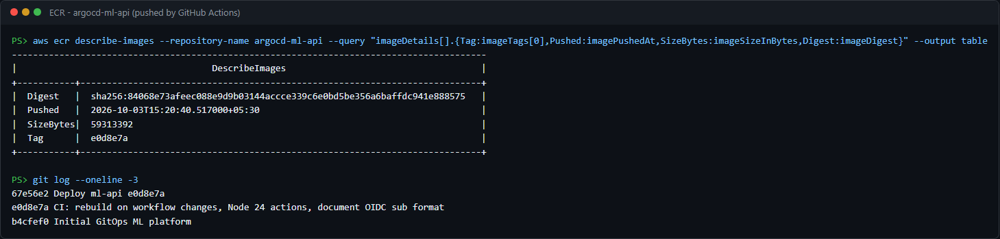

### 3. EKS cluster with Argo CD and the AWS Load Balancer Controller

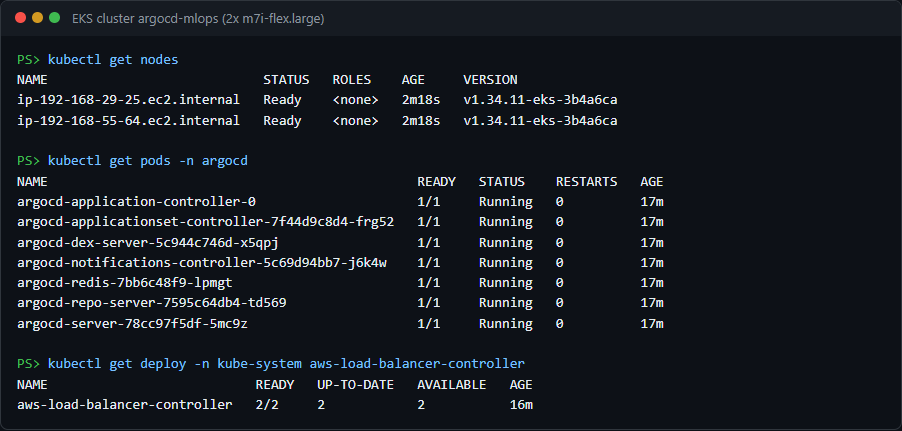

### 4. Argo CD syncs the app from Git

Once `argocd/project.yaml` and `argocd/application.yaml` are applied, Argo CD
syncs everything at the top level of `k8s/`: the Namespace, Deployment,
Service and Ingress.

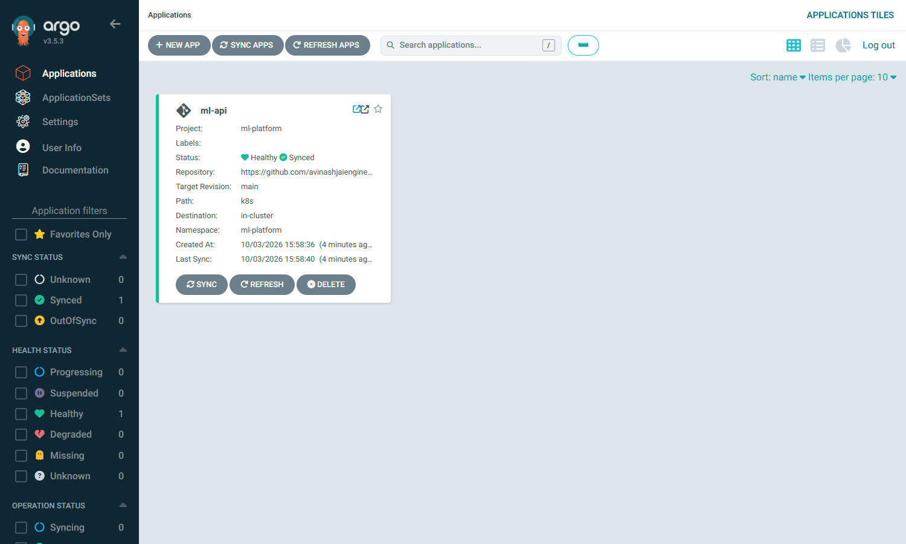


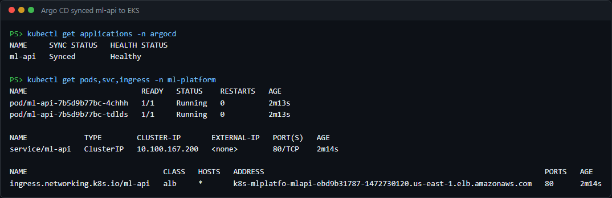

### 5. The ML API on the public internet through the ALB

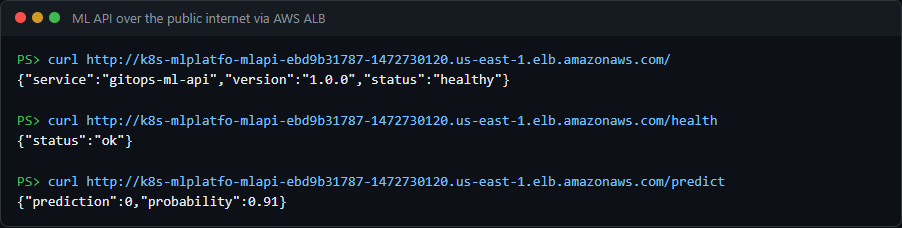

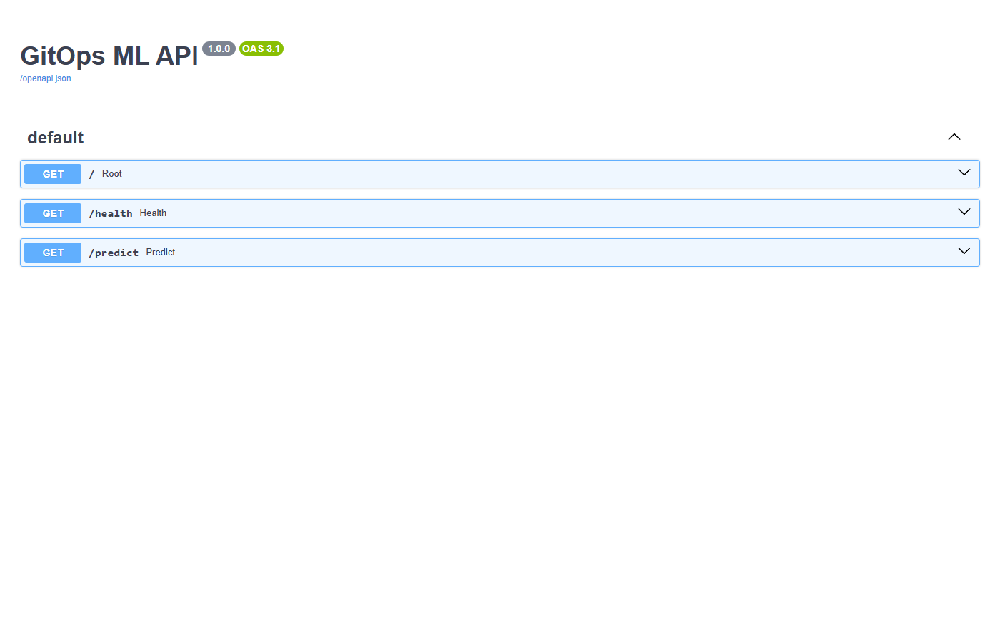

### 6. GitOps change: scale to 3 replicas with a git push

The only change was `replicas: 2` → `3` in Git. There was no `kubectl` and no
manual sync. Argo CD picked up commit `9d5bca0` and rolled it out within
about 12 seconds of the push.

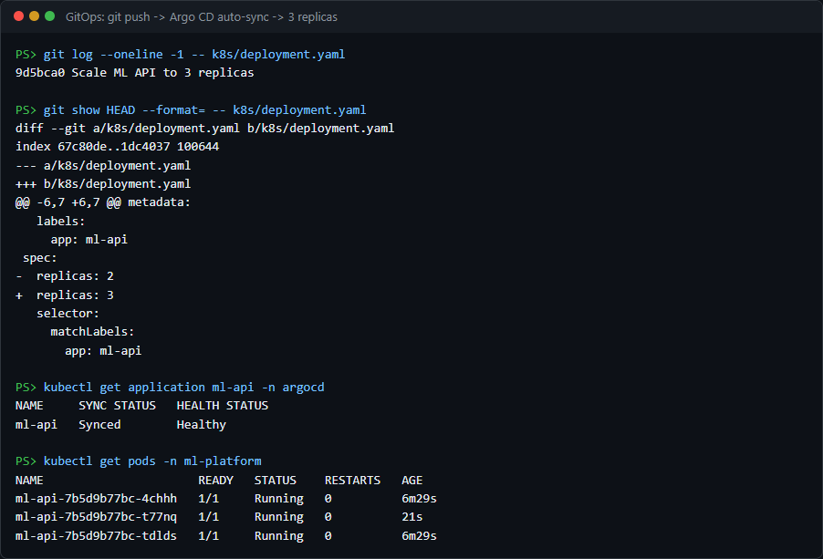

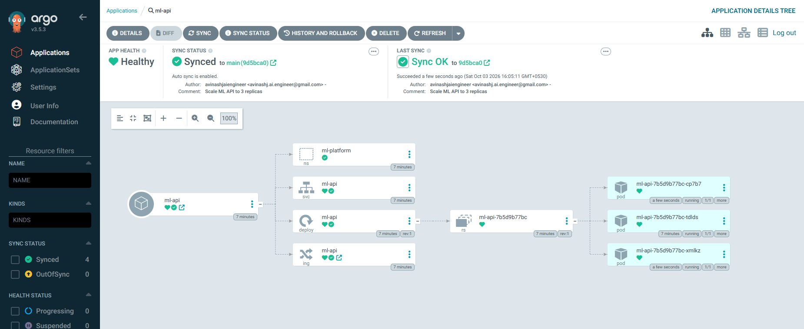

### 7. Self-heal: manual drift is reverted

Someone runs `kubectl scale --replicas=1` by hand. Within a second Argo CD
puts the desired count back to 3 (`1/3` ready), and the cluster recovers to
`3/3`. Git is the source of truth.

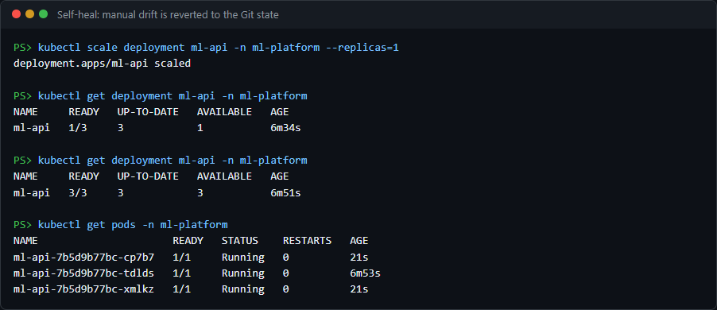

### 8. Deployment history and rollback

Every sync is recorded against a Git commit. Roll back from this panel, or
better, with `git revert`: auto-sync re-applies whatever Git says, so a
revert in Git is the change that lasts.

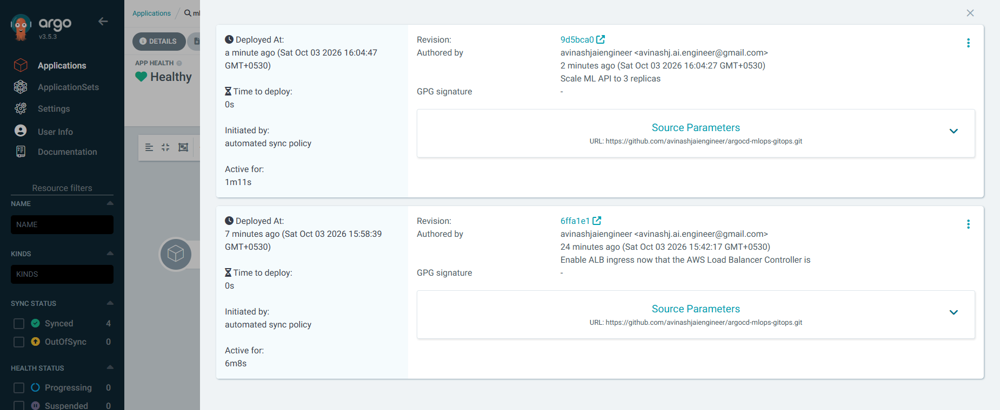

---

## Reproduce it

### Prerequisites

AWS CLI, kubectl, eksctl, Helm and Git. Docker is only needed to build
locally, because CI builds the images.

```powershell
winget install -e --id Kubernetes.kubectl; winget install -e --id eksctl.eksctl; winget install -e --id Helm.Helm
aws sts get-caller-identity
```

These are already filled in for this repo:

| Value | Files |
|-------|-------|
| AWS account `482545366109` | `k8s/deployment.yaml`, `helm/ml-api/values.yaml`, `.github/workflows/build-push.yaml` (role ARN) |
| GitHub user `avinashjaiengineer` | `argocd/application.yaml`, `argocd/project.yaml` |

### 1. Run locally (optional)

```powershell
docker build -t argocd-ml-api:1.0.0 .\app
docker run --rm -p 8000:8000 argocd-ml-api:1.0.0
# http://localhost:8000  /health  /predict  /docs
```

### 2. Create the EKS cluster and ECR repo (this costs money)

```powershell
.\scripts\create-cluster.ps1
```

This creates EKS with 2× `m7i-flex.large` nodes (free-tier eligible) and the
OIDC provider turned on, plus the `argocd-ml-api` ECR repo.

### 3. CI: let GitHub Actions push to ECR

1. Add GitHub as an IAM OIDC identity provider:
   `token.actions.githubusercontent.com`, audience `sts.amazonaws.com`.
2. Create a role (here `gha-argocd-mlops-ecr-push`) that trusts it, limited
   to `main` of this repo. Give it ECR push rights on `argocd-ml-api` only.
   **GitHub now puts owner and repo IDs in the `sub` claim**, so allow both
   forms:
   - `repo:avinashjaiengineer@331991776/argocd-mlops-gitops@1402965963:ref:refs/heads/main`
   - `repo:avinashjaiengineer/argocd-mlops-gitops:ref:refs/heads/main`
3. The workflow uses that role ARN by default. To use a different role, set
   a repo variable `AWS_ROLE_ARN`.
4. If `main` is protected, allow `github-actions[bot]` to push to it, because
   the workflow commits the new image tag there.

Push a change under `app/`. The workflow builds the image, pushes it and
commits the tag to `k8s/deployment.yaml`.

### 4. Install the AWS Load Balancer Controller

```powershell
curl.exe -o alb-iam-policy.json https://raw.githubusercontent.com/kubernetes-sigs/aws-load-balancer-controller/main/docs/install/iam_policy.json
aws iam create-policy --policy-name AWSLoadBalancerControllerIAMPolicy-argocd-mlops --policy-document file://alb-iam-policy.json

eksctl create iamserviceaccount --cluster argocd-mlops --region us-east-1 `
  --namespace kube-system --name aws-load-balancer-controller `
  --role-name eks-argocd-mlops-alb-controller `
  --attach-policy-arn arn:aws:iam::482545366109:policy/AWSLoadBalancerControllerIAMPolicy-argocd-mlops --approve

$VPC = aws eks describe-cluster --name argocd-mlops --query cluster.resourcesVpcConfig.vpcId --output text
helm repo add eks https://aws.github.io/eks-charts
helm upgrade --install aws-load-balancer-controller eks/aws-load-balancer-controller -n kube-system `
  --set clusterName=argocd-mlops --set serviceAccount.create=false `
  --set serviceAccount.name=aws-load-balancer-controller --set region=us-east-1 --set vpcId=$VPC
```

### 5. Install Argo CD and register the app

```powershell
.\scripts\install-argocd.ps1
kubectl port-forward svc/argocd-server -n argocd 8080:443   # https://localhost:8080
kubectl get ingress -n ml-platform                         # ALB DNS name
```

### 6. Try the GitOps loop

- **Scale:** change `replicas` in `k8s/deployment.yaml`, then commit and
  push. Argo CD syncs it (it polls about every 3 minutes, often sooner).
- **Self-heal:** `kubectl scale deployment ml-api -n ml-platform --replicas=1`
  is reverted straight away.
- **Release:** change `app/main.py` and push. CI builds a new image and
  commits the tag, then Argo CD rolls it out.
- **Rollback:** `git revert <deploy commit>` and push.

### 7. Tear down

```powershell
kubectl delete -n argocd application ml-api     # removes the Ingress, so the controller deletes the ALB
eksctl delete iamserviceaccount --cluster argocd-mlops --region us-east-1 --namespace kube-system --name aws-load-balancer-controller
eksctl delete cluster --name argocd-mlops --region us-east-1
aws ecr delete-repository --repository-name argocd-ml-api --region us-east-1 --force
aws iam delete-policy --policy-arn arn:aws:iam::482545366109:policy/AWSLoadBalancerControllerIAMPolicy-argocd-mlops
aws iam delete-role-policy --role-name gha-argocd-mlops-ecr-push --policy-name ecr-push-argocd-ml-api
aws iam delete-role --role-name gha-argocd-mlops-ecr-push
```

---

## Troubleshooting (all hit during the recorded run)

| Symptom | Cause | Fix |
|---------|-------|-----|
| GitHub Actions: `Not authorized to perform sts:AssumeRoleWithWebIdentity` | GitHub's OIDC `sub` claim now includes owner and repo IDs (`owner@id/repo@id`), so the trust policy didn't match | Look up the `AssumeRoleWithWebIdentity` event in CloudTrail to see the exact `sub`, and allow it in the role's trust policy |
| Managed node group stuck in `CREATING`, no EC2 instances, eksctl `exceeded max wait time` | The account is on the **AWS Free plan**, which blocks non-free-tier instance types such as `t3.medium`. CloudTrail shows `RunInstances` failing with `not eligible for Free Tier` | Use a free-tier-eligible type: `aws ec2 describe-instance-types --filters Name=free-tier-eligible,Values=true`. This repo uses `m7i-flex.large` |
| PowerShell script stops on a harmless "not found" check | Windows PowerShell 5.1 with `$ErrorActionPreference = "Stop"` turns native stderr output into a terminating error | The scripts use `Continue` and check `$LASTEXITCODE` |
| `kubectl apply` of Argo CD fails with "metadata.annotations: Too long" | The CRDs are too large for client-side apply | `kubectl apply --server-side --force-conflicts` (as in `install-argocd.ps1`) |
| Argo CD app stuck at `Progressing` on the Ingress | No AWS Load Balancer Controller, so the Ingress never gets an address | Install the controller (step 4) |
